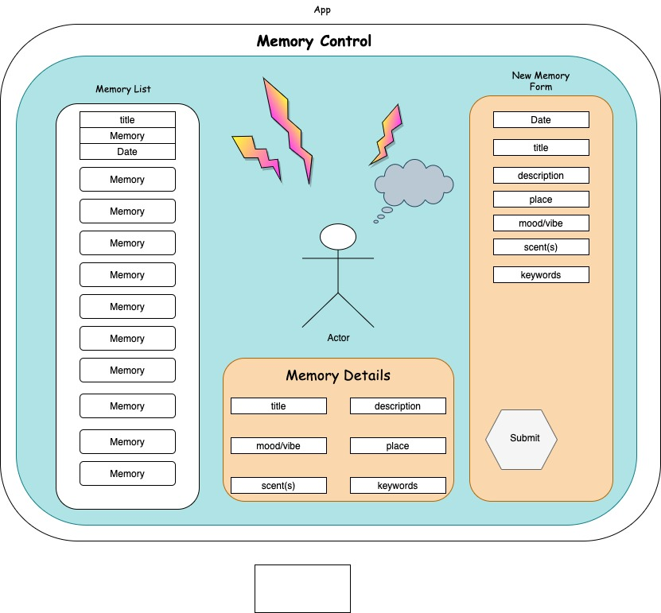

<h1 align="center">
  <br>
	

  <br>
Memory Lane  <br>
</h1>

<h4 align="center">An App for users to submit their memories and store them for later retreival </h4>

<p align="center">
  <a href="#key-features">Key Features</a> •
  <a href="#how-to-use">How To Use</a> •
  <a href="#reach-out"> Reach Out </a> •
  <a href="#credits">Credits</a> •
  <a href="#you-may-also-like">Related</a> •
  <a href="#license">License</a>
</p>

## Key Features

- Tracks memories (title, date, location, description, mood, associated scents )
- Add new memory to database
- See all memories
- Edit or Delete memory
- Mobile Responsive Site
- Navigation Bar (Coming Soon!)

- Cross platform
  - Windows, macOS and Linux ready.

## Wireframe Mockup



## How To Use

To clone and run this application, you'll need [Git](https://git-scm.com), [NPM](https://www.npmjs.com/get-npm) installed. If you wish to review the raw code, it's easiest to download a code editor such as Visual Studio Code or Atom.

### Clone this repository from your Command Line:

`$ git clone https://github.com/brussell36/memory-lane.git`

### Go into the repository

`$ cd memory-lane`

### Open repository in VS Code or other

`$ code .`

### Install dependencies in Root Project Directory (milkbar)

`$ npm install`

### Run the app

`$ npm start`

## Reach Out

Memory Lane is an [emailware](https://en.wiktionary.org/wiki/emailware). Meaning, if you liked using this app or it has helped you in any way, we'd like you send us an email at <mariel.hamson@gmail.com>, <frederick.ernest@gmail.com> about anything you'd want to say about this software. We'd really appreciate it!

## Credits

This software uses the following technologies:

- Javascript
- React (JSX)
- Firebase/Firestore
- CSS (Bootstrap)
- Git versioning

## Support

<a href="https://www.buymeacoffee.com/" target="_blank"></a>

<p>Or</p>

<a href="https://www.patreon.com/">
	
</a>

## You may also like...

-- Other projects in my GitHub Repository

## License

MIT

---
## Mariel Hamson
> LinkedIn [MarielHamson](https://www.linkedin.com/MarielHamson) &nbsp;&middot;&nbsp;
> GitHub [MarielHamson](https://github.com/MarielHamson) &nbsp;&middot;&nbsp;
> Instagram [Miriquitecontrary](https://instagram.com/miriquitecontrary)
## Frederick Ernest
> LinkedIn [FrederickErnest](https://www.linkedin.com/in/frederick-ernest/) &nbsp;&middot;&nbsp;
> GitHub [FrederickErnest] (https://github.com/fetonecontrol?tab=repositories) &nbsp;&middot;&nbsp;

## Benjamin Russell
> LinkedIn [Benjamin Russell](https://www.linkedin.com/in/ben-russell36/)&nbsp;&middot;&nbsp;
> GitHub [Benjamin Russell](https://github.com/brussell36)

```

```
